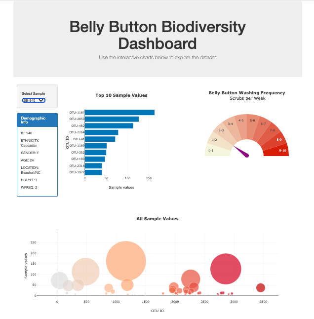

# Interactive Dashboard using Plotly

Welcome to Belly Button Biodiversity Interactive Dashboard!!!

This project builds an interactive dashboard to explore the [Belly Button Biodiversity dataset](http://robdunnlab.com/projects/belly-button-biodiversity/), which catalogs the microbes that colonize human navels.

The dataset reveals that a small handful of microbial species (also called operational taxonomic units, or OTUs, in the study) were present in more than 70% of people, while the rest were relatively rare.

The page was built by using JavaScript, Plotly and D3.js.

### About the Data

Hulcr, J. et al.(2012) _A Jungle in There: Bacteria in Belly Buttons are Highly Diverse, but Predictable_. Retrieved from: [http://robdunnlab.com/projects/belly-button-biodiversity/results-and-data/](http://robdunnlab.com/projects/belly-button-biodiversity/results-and-data/)

© 2019 Trilogy Education Services

### Dashboard

The dashboard showes three charts of the selected sample by a user.

A user can select a sample from the dropdown menu([img](images/select.png)).

Given the sample id, the dashboard displays

* Demographic Information([img](images/demo_info.png))

* Horizontal Bar Chart of 10 OTUs of top sample values([img](images/chart_bar.png))

* Bubble Chart of all sample values([img](images/chart_bubble.png))

* Gauge Chart of Weekly Frequence of Scrubbing([img](images/chart_gauge.png))
